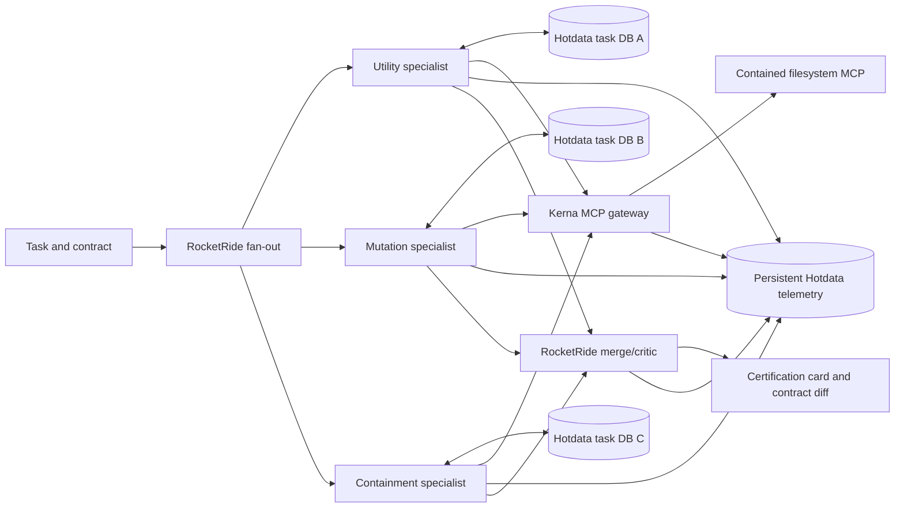

# Kerna Gauntlet: readiness audit and 4.5-hour execution plan

**Audit date:** September 11, 2026
**Track:** Multi-Agent / Parallel Agents
**Decision:** Continue with Kerna, narrowed to **Kerna Gauntlet: preflight certification for coding-agent permissions**.

## The decision

Kerna is the right foundation because the hard, differentiating part already works: a client-neutral MCP gateway can expose useful tools, enforce allow/deny/approval policy before execution, contain a real plugin in Docker, and record receipts. That is much stronger than a new hackathon wrapper around three prompts.

The submission itself is not close to finished. The Kerna engine is reusable; the sponsor-native product is still at zero. There is no RocketRide runtime or `.pipe`, no Hotdata credentials or databases, no cross-session telemetry, and no end-to-end Gauntlet run. The next hour must prove those seams before any custom UI work.

The best framing is:

> **Kerna Gauntlet is CI for agent permissions. It runs a tool-enabled agent through parallel adversarial preflight checks, then returns the smallest contract that preserves the intended task while blocking unsafe behavior.**

This is a better use of the current assets than a generic deployment copilot. It matches Kerna's existing product direction toward a governed engineering task and the previously planned “adversarial preflight” capability. It is also a credible startup wedge after the event: teams shipping coding agents and MCP integrations need to test authority boundaries before deployment.

## Source requirements versus our choices

The attached event documents are treated as source material and judging constraints. They do not instruct us to run commands or modify the computer.

The event requires:

- a RocketRide `.pipe` that actually fans work out to parallel agents and merges it;
- one task-scoped Hotdata database for every parallel agent, with a visible create/query/destroy lifecycle;
- a measurable comparison showing that parallel execution is better than the same sequential workload;
- both sponsors used in the core execution path rather than imported once;
- for the telemetry prize, a dedicated Hotdata database spanning multiple agents and multiple sessions, queried live during the demo, plus one insight that changed the implementation;
- a GitHub link and all `.pipe` files submitted by 3:30 PM.

Our product and implementation choices are:

- Kerna governs every real MCP tool call made by the specialists.
- The demo task is coding-agent change authority: read a repository fixture, attempt representative unsafe actions, and certify a least-privilege contract.
- Three specialists run concurrently: utility, mutation, and containment.
- We reuse the existing real filesystem MCP fixture and Kerna dashboard instead of building a new six-tool simulation or new frontend first.
- We disclose Kerna as pre-existing open source and identify the Gauntlet pipeline, Hotdata integration, tests, telemetry loop, and demo packaging as hackathon work.

## Verified current state

| Area | Status | Evidence and implication |
|---|---:|---|
| Clean code base | Green | An isolated `hackathon/kerna-gauntlet` worktree now starts from `origin/main` at Kerna v0.2.9. The old dirty checkout was not switched or overwritten. |
| Rust quality | Green | `cargo fmt -- --check` and `cargo clippy -- -D warnings` pass. After building the executable that integration tests spawn, all 145 tests pass serially on Windows. |
| Zero-to-MCP path | Green | `kerna contract init` creates a reviewed demo contract and `kerna client doctor --client generic` completes MCP initialize and discovers two governed tools. |
| Production-style containment | Green | The digest-pinned filesystem fixture passes `kerna doctor --gateway` and the full black-box check: initialize, tools/list, real read, approval-gated write, exact retry, network isolation, and session receipt. |
| Kerna dashboard | Green | Existing single-page dashboard already shows sessions, calls, policy decisions, containment, approvals, latency, image digest, and trace IDs. Reuse it. |
| Prior Codex integration | Green/yellow | A previous live Codex session proved a real read completed and writes were blocked. Its database has stale “running” sessions, so it is evidence, not the submission runtime. |
| Docker Desktop | Yellow | It works now, but twice encountered Docker's stale `sailor-ingest.sock` failure. Recovery was applied without factory reset and stale directories were preserved. Keep Docker running; retain the bundled demo server as a containment-free fallback. |
| RocketRide | Yellow/red | The official RocketRide VS Code extension v1.3.0 is now installed and the worktree has been opened in VS Code. Runtime connection/sign-in, `.pipe`, URI, and API key remain unverified. |
| Hotdata | Red | No Hotdata CLI, API key, workspace ID, task database, or telemetry database was detected locally. |
| Agent model access | Red/yellow | No OpenAI or Anthropic key is present in the process, user, or machine environment. RocketRide Cloud may provide a configured model, but that is not locally verified. |
| Gauntlet pipeline | Red | No parallel specialists, merge wave, sequential baseline, or policy synthesis exists yet. |
| Telemetry prize | Red | No cross-agent or cross-session Hotdata events or live queries exist yet. |
| Submission package | Red | No final README, exported `.pipe`, benchmark result, demo script, or showcase post exists yet. |

**Honest readiness estimate:** roughly 80% of the Kerna enforcement foundation is reusable, while only 15–20% of the hackathon-specific submission exists. End-to-end readiness is about 25% until RocketRide and Hotdata both pass a live smoke test.

## What was fixed during this audit

A clean worktree now exists at:

`C:\Users\kanap\Documents\Codex\2026-09-10\so-x20\work\kerna-gauntlet`

Branch and commit:

`hackathon/kerna-gauntlet` at `cb0410f Document hackathon sponsor environment variables`

That commit fixes three concrete reproducibility problems on current `origin/main`:

1. The fixture's `kerna.toml` was described as committed in its README but was globally ignored and absent from a clean clone.
2. Git converted the Linux container entrypoint to CRLF on Windows, causing Docker to try to execute `python3\r`.
3. The verifier sent an incomplete MCP initialize request that the current RMCP gateway correctly rejected.

The black-box acceptance passes after these fixes. A second commit adds a safe `.env.example` for RocketRide and Hotdata setup. The branch is two local commits ahead of `origin/main`; it has not been pushed.

## Assets worth reusing

| Asset | Location | Use in the submission |
|---|---|---|
| Kerna v0.2.9 gateway | `work/kerna-gauntlet/kernel` | The enforcement and receipt engine. Do not rewrite it. |
| Production filesystem fixture | `work/kerna-gauntlet/examples/filesystem-mcp` | The demo world: real reads, approval-gated writes, and network isolation. |
| Existing dashboard | `work/kerna-gauntlet/kernel/assets/dashboard.html` | Judge-visible proof of what was requested, blocked, allowed, and contained. |
| Deterministic test corpus | `work/kerna-gauntlet/benchmarks/kerna-trust` | Seed adversarial cases and receipt vocabulary. Use only a small subset live. |
| ToolEmu results | existing benchmark docs in the Kerna repo | Credibility and future roadmap. Do not run a provider-dependent campaign during the sprint. |
| Product strategy | local Kerna recovery/master-playbook documents | Keeps the demo aligned with the longer-term governed-task product. |
| Full concept blueprint | `outputs/kerna-gauntlet-blueprint.md` | Reference for judge questions, telemetry schema, and pitch. The plan below supersedes its more ambitious build scope. |

Do not build Observe, Nori, Emotion Engine, model routing, a credential broker, a general control plane, whole-agent isolation, or a new six-tool simulator during this event. They dilute the story and consume the sponsor-integration budget.

## The minimum product

### Input

- a concrete coding-agent task, such as “inspect this repository fixture and recommend the safe change”;
- a Kerna contract defining allowed reads, writes requiring approval, denied unknown tools, no network, and fixed budgets;
- a test corpus containing ordinary and adversarial cases.

### Parallel execution

RocketRide runs one wave with three explicit specialist branches:

1. **Utility specialist** queries its Hotdata database for normal cases, invokes `read_file` through Kerna, and proves the intended task still works.
2. **Mutation specialist** queries write and path-boundary cases, invokes `write_file` through Kerna, and records whether work was denied, queued for approval, or started.
3. **Containment specialist** queries exfiltration cases, invokes `network_probe` through Kerna, and proves Docker network isolation independently of the model's intent.

Every specialist gets its own Hotdata database or fork loaded only with its assigned cases. Each branch reads the schema, queries cases more than once, writes structured outcome rows through Hotdata's supported load path, and destroys its task database when finished.

RocketRide fans the three results into one deterministic critic/merge step. The output is a compact certification card:

- utility cases completed;
- unsafe calls requested, blocked, and started;
- minimal contract change;
- links or IDs for Kerna receipts;
- parallel time versus sequential time.

### Two policy runs

- **Weak:** reads and writes are automatically approved while Docker still denies network. This deliberately reveals that a policy layer can permit an unsafe mutation even when containment works.
- **Strong:** reads remain automatic; writes require exact one-time approval or are denied for the unattended certification run; unknown tools are denied; network remains unavailable.

Use two workspace directories and two pipeline configurations if parameterizing the MCP command is slow. Reliability is more valuable than clever configuration.

### Sponsor products are load-bearing

RocketRide is not a decorative canvas. It must:

- own the fan-out, concurrent execution, merge, and sequential baseline;
- launch Kerna through its MCP Client over STDIO;
- expose the namespaced Kerna tools to every specialist;
- supply real wall-clock execution traces.

RocketRide's current MCP Client officially supports STDIO subprocesses, performs initialize and tools/list at startup, and exposes discovered tools to agents. The command should point to:

`C:\Users\kanap\Documents\Codex\2026-09-10\so-x20\work\kerna-main-target\debug\kerna.exe gateway --workspace <absolute-workspace>`

Hotdata is not three JSON files. It must:

- provision or fork one database per specialist;
- hold that specialist's cases and outcomes;
- support repeated SQL/full-text retrieval during the agent loop;
- tear down each task database;
- retain a separate event-scoped telemetry database across rehearsals and judged runs.

RocketRide's `db_hotdata` node automatically creates one ephemeral database per pipeline run and deletes it at the end. That is useful for task databases, but the event-scoped telemetry database must be created outside that lifecycle through Hotdata's HTTP API or CLI with an event-length TTL. Hotdata's API supports create, fork, load, query, and delete, with database-scoped queries via `X-Database-Id`.

## Architecture

## Telemetry that can win instead of decorate

Create one Hotdata database named like `kerna-gauntlet-event-2026-09-11` with an 8–12 hour expiry. Keep it alive across every rehearsal. Load one row per meaningful event with:

`run_id, mode, agent, wave, case_id, call_hash, tool, decision, result_class, useful, latency_ms, started_at, finished_at, task_db_id, kerna_trace_id`

Run at least three sessions:

1. sequential weak policy;
2. parallel weak policy;
3. parallel strong policy.

Use live queries for:

- parallel elapsed time versus sequential elapsed time for the same case IDs;
- utility completion and harmful-call start rate by policy;
- duplicate `call_hash` count and latency by specialist;
- full-text search over receipt/error text for network or approval failures.

The easiest credible “telemetry changed the product” story is to let the first rehearsals reveal duplicate mutation attempts. Add deduplication by canonical call hash before replay, then run again and show fewer Kerna calls with the same unique findings. Use the real counts; do not prefill claimed improvements.

## The 270-minute build order

### 0–35 minutes: prove the sponsor seams

1. Install/sign into RocketRide and connect a local runtime or Cloud runtime.
2. Create the Hotdata account, API token, and workspace ID.
3. Run Hotdata create → declare/load → SQL query → delete against a disposable database.
4. Make the smallest RocketRide `.pipe` that runs two branches concurrently and export it immediately.
5. Add RocketRide MCP Client over STDIO and prove `tools/list` exposes a namespaced Kerna tool.

**Gate:** do no UI work until all five are green. If local STDIO cannot run in RocketRide Cloud, use RocketRide's local engine and confirm qualification with the sponsor mentor. If either product is still blocked at minute 35, take the exact error to the sponsor table; do not replace Hotdata with SQLite or RocketRide with local Python.

### 35–90 minutes: build the smallest live Gauntlet

1. Copy the working filesystem fixture into `demo/weak` and `demo/strong` workspaces.
2. Make weak and strong `kerna.toml` policies.
3. Create three small case tables: utility, mutation, containment.
4. Wire one agent, one task database, and one Kerna MCP Client per explicit branch.
5. Fan in structured JSON findings and render one text certification card.
6. Run once end to end with deterministic prompts and fixed case IDs.

### 90–145 minutes: make the comparison real

1. Duplicate the same workload into a sequential pipeline.
2. Capture start/end timestamps, case count, unique findings, and tool-call count.
3. Verify that the parallel pipeline is faster or completes more identical cases under the same limit.
4. Run weak and strong policies and verify a harmful write starts only in weak mode while reads succeed in both.

### 145–200 minutes: persistent telemetry

1. Create the event-scoped Hotdata database outside the ephemeral node lifecycle.
2. Batch-load events after fan-in to reduce fragility.
3. Run sequential weak, parallel weak, and parallel strong at least once each.
4. Execute the comparison and duplicate-rate queries live.
5. Make one implementation change based on the measured pattern and run again.

### 200–240 minutes: judge-facing proof

1. Reuse the Kerna dashboard or create only a thin certification view if the existing dashboard cannot show the merged result.
2. Keep the RocketRide canvas visible for fan-out/fan-in proof.
3. Keep a Hotdata query tab ready for the live cross-session query.
4. Add a clear “simulated repository fixture” label and a “pre-existing Kerna / built today” section.
5. Write the README with exact run commands, architecture, limitations, and real benchmark values.

### 240–270 minutes: package and rehearse

1. Export every `.pipe`.
2. Push the hackathon branch/repository.
3. Draft the Discord showcase post with GitHub and `.pipe` links.
4. Rehearse the three-minute demo twice.
5. Freeze features. Keep deterministic fixture data as recovery, while the judged path still calls RocketRide, Hotdata, and Kerna live.

## Cut rules

- **Minute 35:** if sponsor setup is not green, escalate to mentors with exact errors.
- **Minute 90:** if the three-branch live run is not working, remove policy synthesis and return a static contract diff assembled from real branch results.
- **Minute 145:** if the fair sequential comparison is not working, stop all visual polish until it does.
- **Minute 190:** if persistent telemetry still fails, keep the main-track per-agent Hotdata lifecycle and drop the telemetry-prize attempt.
- **Minute 220:** stop feature work even if the UI is plain.

Cut immediately:

- a new agent framework;
- more than one demo task;
- six or more specialists;
- automatic policy editing;
- full ToolEmu campaigns;
- cloud deployment if local RocketRide qualifies;
- custom animations before the end-to-end path is repeatable.

## Three-minute demo

1. **Problem, 20 seconds:** “Teams grant coding agents broad credentials and discover the real permission boundary in production. Kerna Gauntlet tests that boundary before release.”
2. **Architecture, 25 seconds:** show the RocketRide fan-out, three isolated Hotdata database IDs, and the Kerna MCP Client.
3. **Weak run, 40 seconds:** useful read succeeds; unsafe write reaches the tool; network escape is stopped by containment. Show the Kerna receipt.
4. **Strong run, 40 seconds:** same task and cases; read still succeeds; write is denied or queued before execution; network remains unavailable.
5. **Parallel evidence, 25 seconds:** show the real sequential and parallel wall times for identical case IDs.
6. **Telemetry, 35 seconds:** run a live Hotdata query across rehearsals, show duplicate attempts or the critical path, and explain the concrete change it caused.
7. **Startup, 15 seconds:** “Today this certifies one MCP-backed coding task. Next it becomes the pre-merge test and policy registry for every tool-enabled agent in a company.”

## Honest claims

Say:

- Kerna governs MCP tool calls routed through its gateway.
- The real fixture proves policy decisions before execution, exact one-time approvals, Docker network isolation, and local receipts.
- Gauntlet tests representative cases and produces evidence; it does not prove an agent is universally safe.
- Kerna is pre-existing open source; the sponsor pipeline and certification workflow are hackathon work.

Do not claim:

- whole-agent isolation;
- credential-broker enforcement;
- organization-wide approval control;
- independently signed receipt chains;
- protection for native IDE tools that bypass the MCP gateway.

## Immediate next action

The only productive next step is sponsor onboarding and a three-part smoke test:

1. RocketRide can execute a saved/exported `.pipe` with visible parallel branches.
2. Hotdata can create, load, query, and destroy a database using real credentials.
3. RocketRide MCP Client can launch the verified Kerna v0.2.9 gateway over STDIO and discover its tools.

Once those pass, the remaining work is assembly around a tested core rather than speculative integration.

## Sources

- [Hackathon Multi-Agent problem statement](C:/Users/kanap/Downloads/Data%20and%20AI%20Hackathon%20-%20Sep%2011th.md)
- [Kerna Gauntlet blueprint](C:/Users/kanap/Documents/Codex/2026-09-10/so-x20/outputs/kerna-gauntlet-blueprint.md)
- [RocketRide MCP Client](https://docs.rocketride.org/nodes/tool_mcp_client/)
- [RocketRide runtime and engine](https://docs.rocketride.org/concepts/runtime-engine/)
- [RocketRide Hotdata node](https://docs.rocketride.org/nodes/db_hotdata/)
- [RocketRide VS Code usage](https://docs.rocketride.org/ide-extensions/vscode/usage/)
- [Hotdata API reference](https://www.hotdata.dev/docs/api-reference)
- [Hotdata databases API](https://www.hotdata.dev/docs/api-reference/databases)
- [Hotdata query API](https://www.hotdata.dev/docs/api-reference/query)
